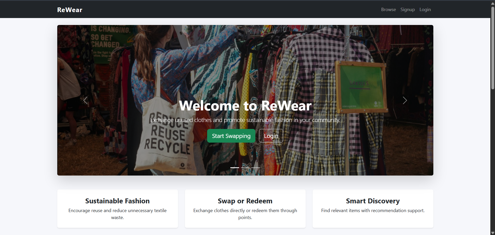
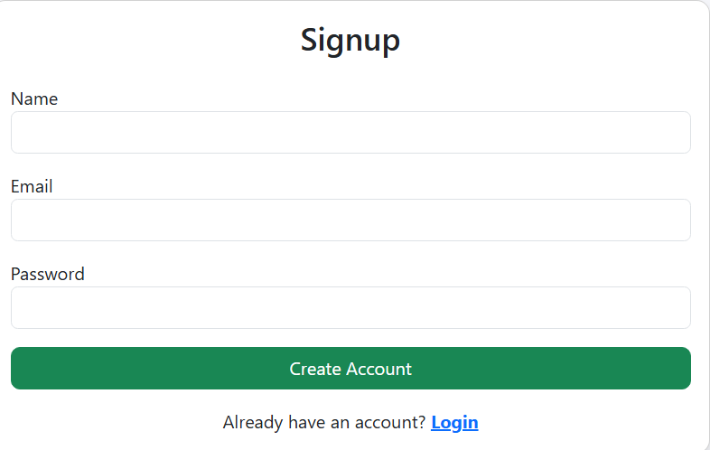
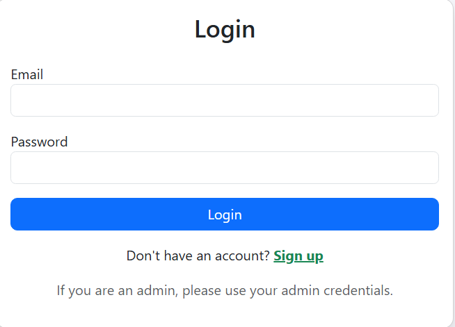
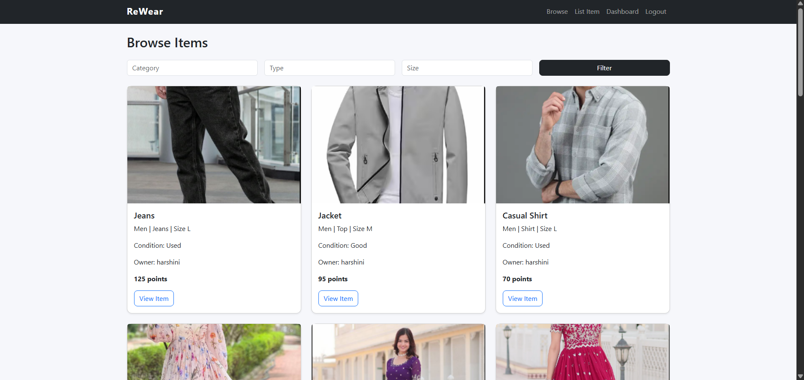
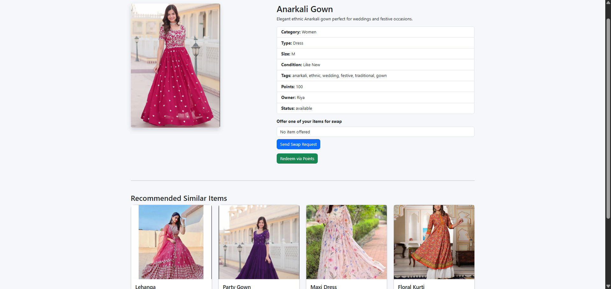
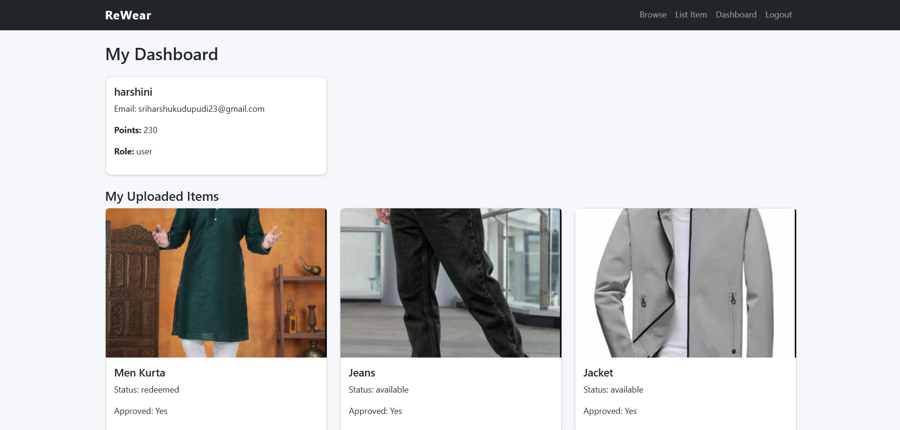
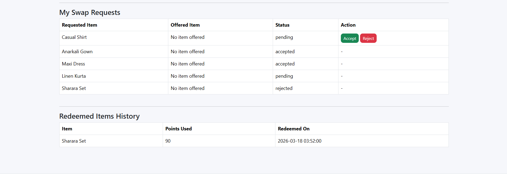

# ReWear — Smart Community Clothing Exchange

A full-stack Flask web application for sustainable fashion. Swap clothes,
earn points, and discover items through ML-powered content recommendations.

## Quick Start

```bash
pip install Flask Werkzeug scikit-learn numpy
python app.py
# open http://localhost:5000
```

## Demo Accounts

| Role  | Email            | Password |
|-------|------------------|----------|
| Admin | admin@rewear.com | admin123 |
| User  | priya@demo.com   | demo123  |
| User  | rahul@demo.com   | demo123  |
| User  | ananya@demo.com  | demo123  |

## Stack

- Backend: Flask 3, Python 3, SQLite (stdlib sqlite3)
- Frontend: Bootstrap 5, jQuery 3, custom CSS
- ML: scikit-learn TF-IDF + cosine similarity
- Templating: Jinja2

## ML Recommendations

`model/recommender.py` builds a feature string per item
(category + type + size + condition + tags + price tier),
vectorises with TF-IDF, and ranks by cosine similarity.
Top-4 results appear on each item detail page.

## API

GET /api/recommendations/<item_id>  — returns JSON array of similar items

## Points System

- Signup: 100 pts
- Swap completed: +30 pts each side
- Redeem item: spend its listed point value

## Screenshots

### Homepage


### Signup


### Login


### Browse


### Recommendation


### dashboard1


### continuation of dashboard



